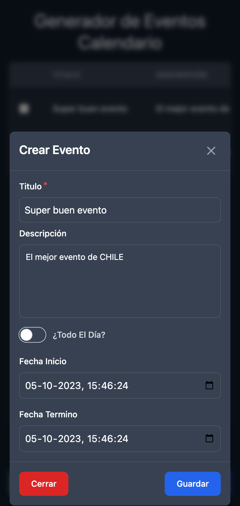

# Ical Events Calendar Generator

Simple event calendar generator in iCal format.

## Installation

Install dependencies with you prefer package manager. In my case, I use

```sh
  cd ical-events-calendar-generator/
  pnpm install
```

## Usage

Only you must run the `start` script, e.g. `pnpm start`.

## Demo

### Mobile Version


*Home Page*



*New Event Page*

### Desktop Version


*Home Page*


*New Event Page*